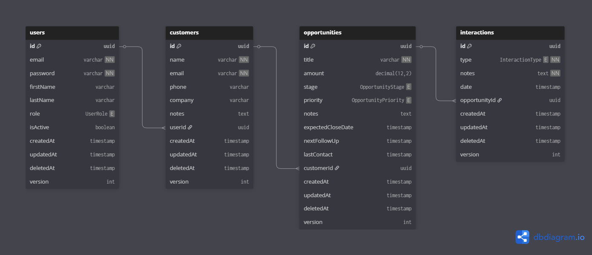
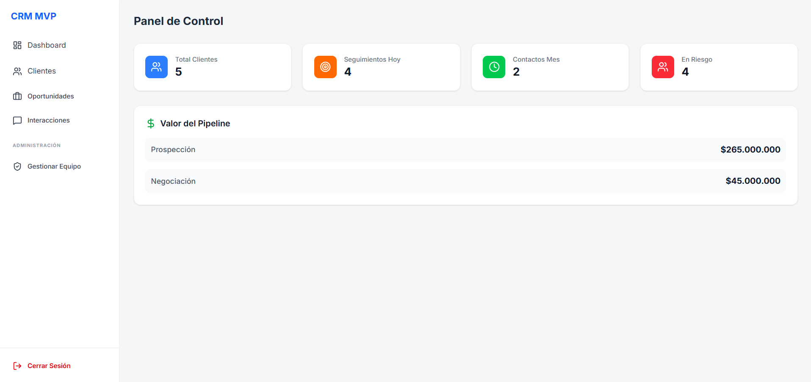
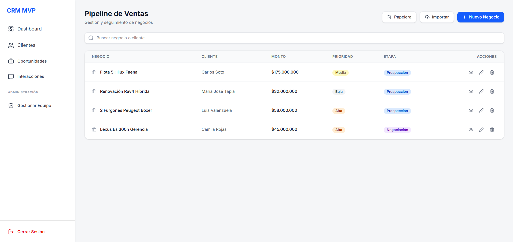
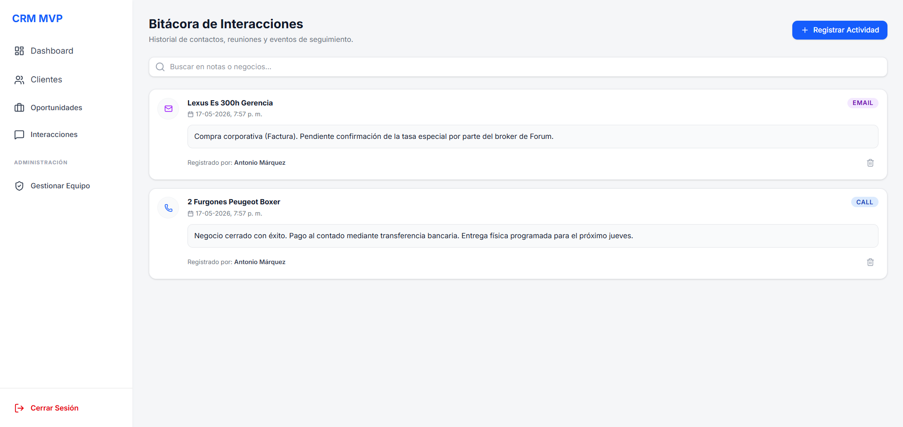
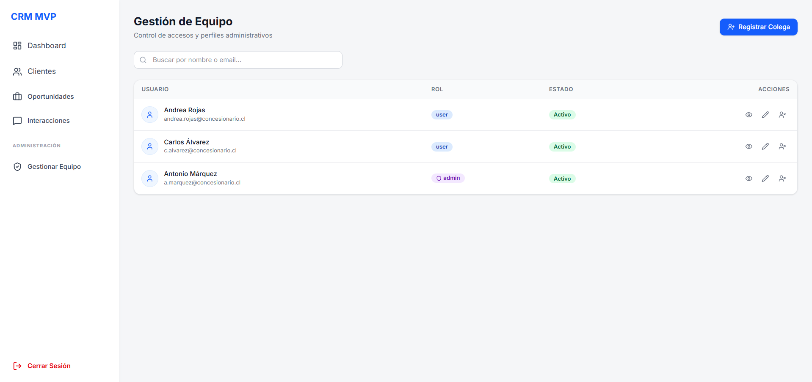
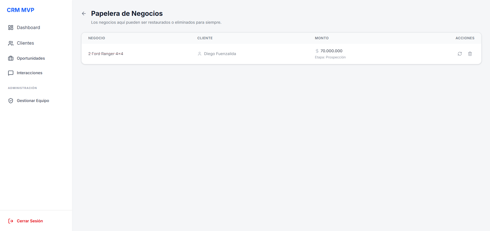

# CRM COMERCIAL - MVP 🚗💼

Este es un sistema de Gestión de Relaciones con Clientes (CRM) diseñado específicamente para optimizar el pipeline de ventas en el sector automotriz. La aplicación permite gestionar el ciclo de vida completo de una oportunidad comercial, desde el contacto inicial hasta el cierre del negocio, asignación de ejecutivos, bitácora de interacciones y un sistema avanzado de recuperación de datos (Soft Delete).

---

## 🚀 Stack Tecnológico

El proyecto está construido bajo una arquitectura desacoplada utilizando herramientas modernas y tipado estricto de extremo a extremo:

* **Backend:** NestJS (Framework modular progresivo de Node.js) & TypeScript.
* **Frontend:** Next.js (App Router), React & Tailwind CSS.
* **Base de Datos:** PostgreSQL.
* **Gestión de Dependencias:** pnpm.
* **Infraestructura:** Docker & Docker Compose (para consistencia en entornos de desarrollo).

---

## 🏛️ Arquitectura y Lógica de Negocio

### Backend (NestJS)
Diseñado bajo los principios de **Arquitectura Modular**. Cada dominio (*Users, Customers, Opportunities, Interactions*) está encapsulado en su propio módulo, garantizando alta cohesión y bajo acoplamiento:
* **Controladores:** Exposición de endpoints RESTful limpios y validados mediante `class-validator`.
* **Servicios:** Capa de lógica de negocio pura aislada de la infraestructura.
* **Persistencia:** Repositorios optimizados mediante queries relacionales y paginación nativa controlada por metadatos (`limit`, `offset`, `totalCount`, `lastPage`).
* **Seguridad:** Autenticación robusta implementada mediante JSON Web Tokens (JWT) con guardianes (`Guards`) para el control de acceso basado en roles (`admin` / `user`).

### Frontend (Next.js & React)
Implementado bajo un enfoque de **Dashboard SPA (Single Page Application)** dinámico:
* **Custom Hooks & Control de Flujo:** Consumo asíncrono optimizado mediante envolturas `useCallback` y control de desmontaje (`isMounted`) para mitigar fugas de memoria y *cascading renders* innecesarios recomendados por el equipo core de React.
* **Optimización UI/UX:** Refrescos silenciosos de datos en segundo plano tras mutaciones exitosas (POST/PATCH/DELETE) para evitar parpadeos visuales molestos, combinados con estados de carga basados en *Skeletons* de alta fidelidad.

---

## 📊 Modelo de Datos (Esquema de BD)

El diseño relacional asegura la integridad referencial y un histórico fidedigno de interacciones.



---

## 🔥 Funcionalidades Clave

### 1. Panel de Control (Dashboard) y KPIs en Tiempo Real
Visualización instantánea del estado comercial del negocio. Incluye tarjetas de métricas clave (clientes totales, seguimientos pendientes) y un desglose dinámico del valor monetario del pipeline según la etapa de negociación, formateado para la moneda local.



### 2. Pipeline de Ventas y Búsqueda Predictiva
Listado centralizado para la gestión de oportunidades. Cuenta con indicadores visuales (badges) para clasificar rápidamente la prioridad (Alta, Media, Baja) y la etapa del negocio. Incorpora una barra de búsqueda optimizada para filtrar clientes o negocios de forma eficiente.



### 3. Bitácora de Interacciones Enriquecida
Historial cronológico fundamental para el seguimiento de clientes. Permite registrar cada punto de contacto diferenciando el canal de comunicación (Email, Llamada, etc.) mediante identificadores visuales, indicando la fecha, la nota descriptiva y qué miembro del equipo registró la actividad.



### 4. Gestión de Equipo y Control de Accesos (RBAC)
Módulo de administración para el control de la fuerza de ventas. Implementa seguridad basada en roles (Administrador vs. Usuario estándar), visualización del estado de las cuentas (Activo/Inactivo) y herramientas para auditar o modificar los accesos al sistema CRM.



### 5. Papelera de Negocios y Recuperación (Soft Delete)
Mecanismo de seguridad para prevenir la pérdida accidental de datos sensibles. Los negocios eliminados no se borran de la base de datos inmediatamente, sino que pasan a una papelera donde un administrador puede auditar, restaurar la oportunidad con un clic, o ejecutar una eliminación definitiva.



---

## ⚙️ Configuración del Entorno de Desarrollo

### Requisitos Previos
* Node.js (v18 o superior)
* pnpm (`npm i -g pnpm`)
* Docker & Docker Compose

### 1. Clonar el repositorio
```bash
git clone https://github.com/tu-usuario/tu-repo-crm.git
cd tu-repo-crm
```

### 2. Variables de Entorno
Configura los archivos `.env` tanto en la raíz del backend como del frontend guiándote por los archivos `.env.example` provistos en cada carpeta.

### 3. Levantar Infraestructura (Base de Datos)
```bash
docker-compose up -d
```

### 4. Ejecución del Proyecto

**Para el Backend:**
```bash
cd server
pnpm install
pnpm run start:dev
```

**Para el Frontend (Client):**
```bash
cd client
pnpm install
pnpm run dev
```

---

## 📄 Licencia

Este proyecto es de uso público con fines de mostrar en el portafolio y demostrar técnica profesional.
