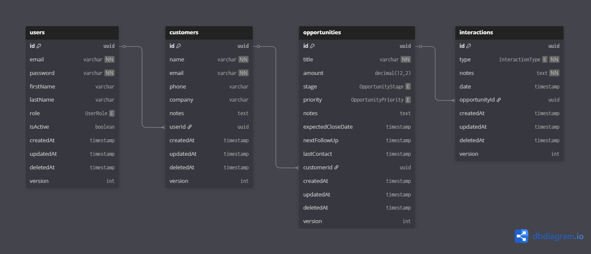
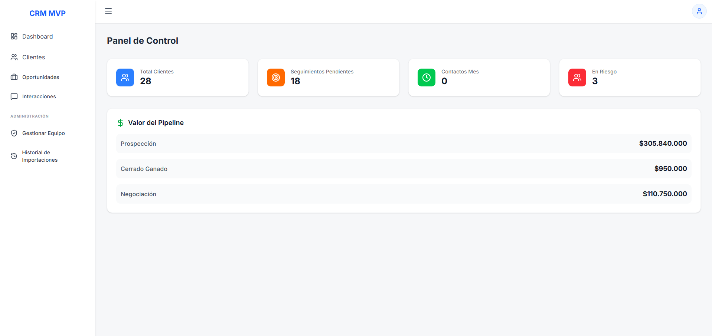
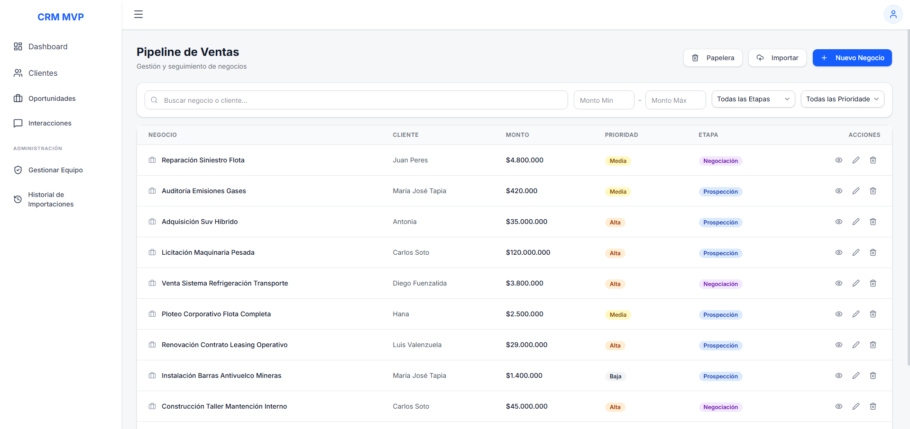
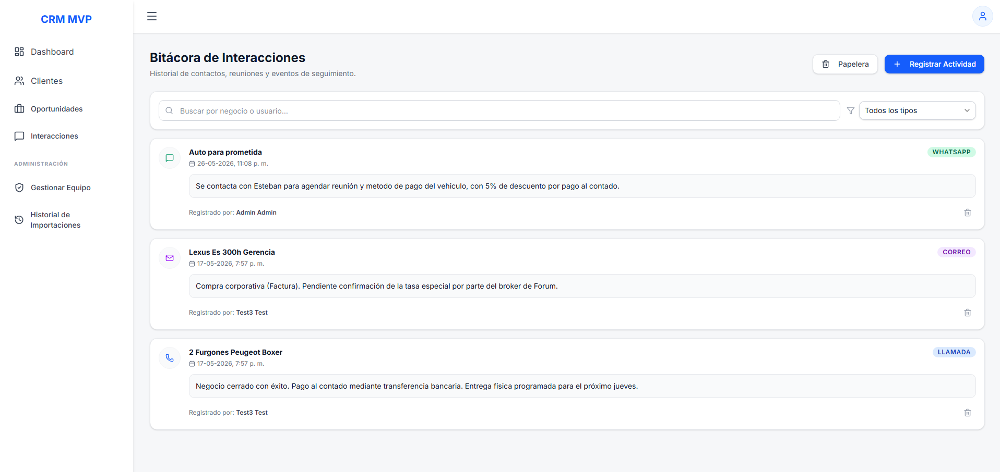
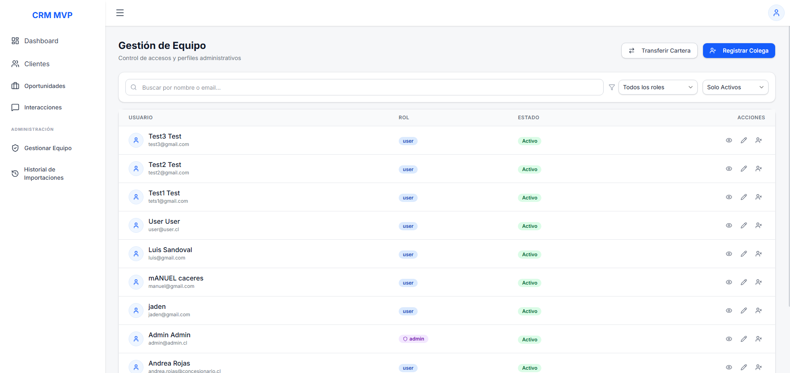
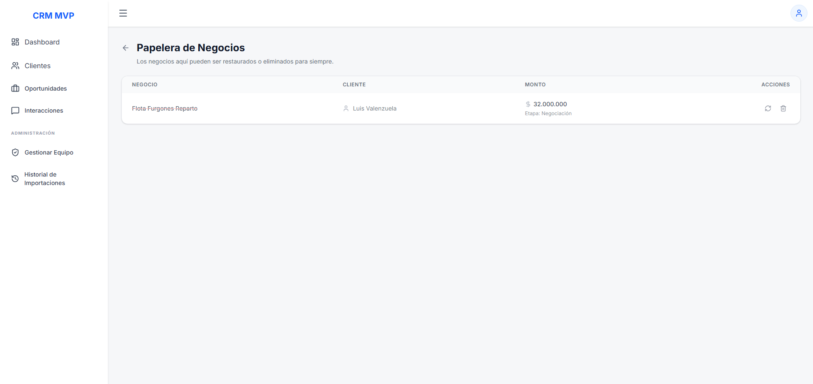
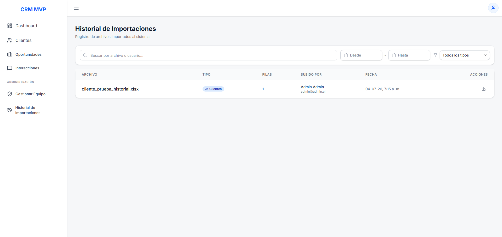
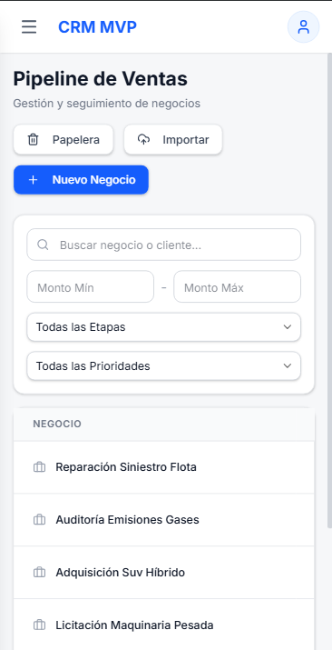
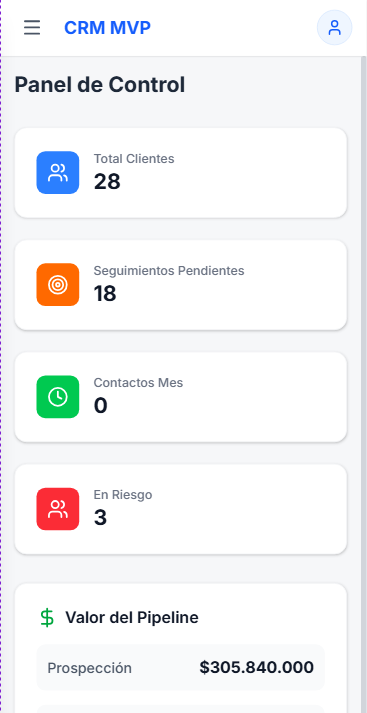

# Commercial Automotive CRM 🚗💼

> **Nota:** este repositorio documenta un proyecto CRM desarrollado de forma privada para el sector automotriz. El código fuente vive en un repositorio privado; este espacio muestra la arquitectura, las decisiones técnicas y capturas del sistema en funcionamiento. Para verlo funcionando en vivo, usa el link de demo más abajo.

Sistema de Gestión de Relaciones con Clientes (CRM) diseñado específicamente para optimizar el pipeline de ventas en el sector automotriz. La aplicación gestiona el ciclo de vida completo de una oportunidad comercial, desde el contacto inicial hasta el cierre del negocio, con asignación de ejecutivos, bitácora de interacciones y un sistema avanzado de recuperación de datos (Soft Delete).

---

## 🚀 Stack Tecnológico

Arquitectura desacoplada con tipado estricto de extremo a extremo:

* **Backend:** NestJS (Node.js) & TypeScript
* **Frontend:** Next.js (App Router), React & Tailwind CSS
* **Base de Datos:** PostgreSQL + TypeORM
* **Gestión de Dependencias:** pnpm
* **Infraestructura:** Docker & Docker Compose (desarrollo), Render + Supabase + Vercel (producción)
* **Almacenamiento:** AWS S3 (importación de archivos)

---

## 🏛️ Arquitectura y Lógica de Negocio

### Backend (NestJS)
Diseñado bajo principios de **Arquitectura Modular**. Cada dominio (*Users, Customers, Opportunities, Interactions, Import*) está encapsulado en su propio módulo, con alta cohesión y bajo acoplamiento:

* **Controladores:** Endpoints RESTful validados mediante `class-validator`, documentados con Swagger/OpenAPI.
* **Servicios:** Capa de lógica de negocio aislada de la infraestructura.
* **Persistencia:** Repositorios con paginación server-side controlada por metadatos (`limit`, `offset`, `totalCount`, `lastPage`).
* **Seguridad:** JWT con Guards para control de acceso basado en roles (`admin` / `user`).

### Pipeline de Importación Masiva (S3) — el diferenciador técnico del proyecto
Sistema de importación de clientes/oportunidades vía Excel/CSV con arquitectura de nivel producción:

* Subida a S3 en zona `pending/`, con `finalize` (mover a ubicación definitiva) solo tras validación completa.
* Transacción todo-o-nada: si una fila falla, no se guarda nada en BD ni se mueve el archivo en S3.
* Rollback en cascada: si falla el guardado post-finalize, se elimina el archivo ya movido en S3 (evita huérfanos).
* Descarga del archivo original vía URL firmada de S3 con expiración corta.
* Historial de importaciones (`ImportLog`) con búsqueda, filtro por tipo, rango de fechas y paginación.

### Frontend (Next.js & React)
Dashboard SPA con foco en experiencia percibida:

* **Custom Hooks:** consumo asíncrono con `useCallback` y control de desmontaje (`isMounted`) para evitar fugas de memoria y *cascading renders*.
* **UX pulida:** refrescos silenciosos tras mutaciones (POST/PATCH/DELETE) sin parpadeos, estados de carga con Skeletons.
* **Responsive real:** tablas que colapsan a tarjetas en mobile, no solo scroll horizontal forzado.

---

## 📊 Modelo de Datos

---

## 🔥 Funcionalidades Clave

### 1. Panel de Control (Dashboard) y KPIs en Tiempo Real
Visualización instantánea del estado comercial: clientes totales, seguimientos pendientes, contactos del mes y valor del pipeline desglosado por etapa.

### 2. Pipeline de Ventas y Búsqueda Predictiva
Listado centralizado de oportunidades con badges de prioridad (Alta/Media/Baja) y etapa del negocio, más búsqueda con debounce.

### 3. Bitácora de Interacciones Enriquecida
Historial cronológico por cliente, diferenciando canal de comunicación (Email, Llamada, WhatsApp, etc.), con fecha, nota y responsable del registro.

### 4. Gestión de Equipo y Control de Accesos (RBAC)
Administración de la fuerza de ventas: roles (Admin/Usuario), estado de cuentas (Activo/Inactivo), auditoría de accesos.

### 5. Papelera de Negocios y Recuperación (Soft Delete)
Los negocios eliminados no se borran de inmediato — pasan a una papelera donde un Admin puede restaurar con un clic o eliminar definitivamente.

### 6. Importación Masiva de Clientes (Excel/CSV vía S3)
Carga de archivo, mapeo de columnas y confirmación de registros importados, con historial completo y descarga del archivo original.

---

## 📱 Diseño Responsive

La interfaz está pensada mobile-first: las tablas colapsan a vista de tarjetas en pantallas pequeñas, en vez de forzar scroll horizontal.

---

## 🧪 Testing

* Tests unitarios sobre lógica de negocio no trivial (rollback transaccional de importación, guards de rol, filtros dinámicos).
* Tests E2E cubriendo el happy path completo: login → creación de cliente → importación de archivo → verificación en historial.

---

## 👤 Autor

**Miguel Fuenzalida Navarro** — Desarrollador Full Stack
📍 Curicó, Chile

* Portafolio: [https://mfuenzalida-dev.vercel.app/]
* LinkedIn: [https://www.linkedin.com/in/miguel-fuenzalida/]
* Email: miguelfuenzalida.n@gmail.com

---

## 📄 Licencia

Este repositorio se comparte públicamente con fines de portafolio y demostración técnica.